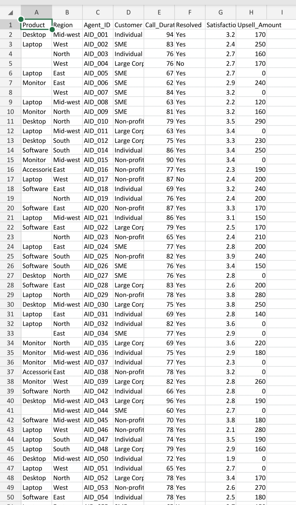

# Excel Data Cleaning Automation using Python

## 📌 Project Overview

This project demonstrates a **real-world Excel/CSV data cleaning automation workflow** using Python.  
It simulates a client-provided messy dataset, applies structured cleaning logic, and produces a **clean, analysis-ready Excel file**.

This project is designed as a **portfolio example for Fiverr and freelance clients** who need automated data cleaning solutions.

---

## 🧩 Problem Statement (Client Requirement)

The client provided a large Excel/CSV file where:

- Data was inconsistent and poorly structured
- Multiple values were merged into single columns
- Manual cleaning was time-consuming and error-prone

### Client wanted:
- Properly separated and standardized columns  
- Clean, structured Excel output  
- Fully automated solution for large datasets  

---

## 🖼️ Project Walkthrough

### 1️⃣ Raw Messy Data (Client Input)

The original dataset contained inconsistent formatting, mixed values, and irregular structures.


---

### 2️⃣ Automation Logic (Python Script)

A Python script was written using **Pandas and Regex** to:
- Read raw Excel/CSV files
- Clean and normalize data
- Handle missing or invalid values
- Apply business rules
- Export clean output automatically


---

### 3️⃣ Cleaned Output (Final Result)

The final output is a **clean, structured Excel file** ready for reporting and analysis.



---

### 4️⃣ Project Structure

The project follows a clean, scalable structure suitable for real client projects.


---

## 📂 Project Structure

excel-data-cleaning-automation/ │ ├── data/ │   └── raw/ │       └── raw_client_data.csv │ ├── scripts/ │   ├── create_raw_excel.py │   └── clean_excel_data.py │ ├── output/ │   └── cleaned_client_data.xlsx │ ├── images/ │   ├── 01_challenge.jpg │   ├── 02_automation_logic.jpg │   ├── 03_output.jpg │   └── 04_project_structure.jpg │ ├── .gitignore └── README.md

---

## 🛠️ Technologies Used

- Python
- Pandas
- Regular Expressions (Regex)
- Excel / CSV Processing
- Git & GitHub

---

## 🚀 How to Run the Project

```bash
# Clone repository
git clone https://github.com/anil18-dev/excel-data-cleaning-automation.git

# Navigate into project
cd excel-data-cleaning-automation

# Install dependencies
pip install pandas openpyxl

# Run cleaning script
python scripts/clean_excel_data.py

Contact - anildangiii18@gmail.com
Anil Dangi
Python Automation | Data Cleaning | Excel Processing
If you need a similar solution for your data, feel free to connect.
